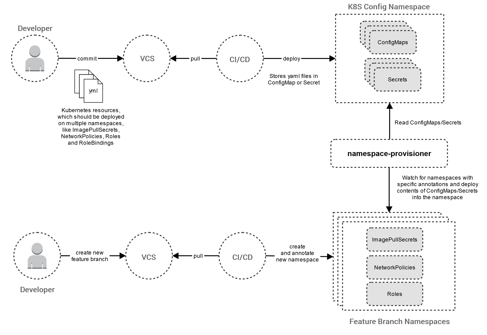

<!-- SPDX-License-Identifier: MIT -->
# Namespace Provisioner

[](https://github.com/Daimler/namespace-provisioner)
[](https://goreportcard.com/report/github.com/Daimler/namespace-provisioner)
[](https://github.com/Daimler/namespace-provisioner/blob/master/LICENSE)
[](https://github.com/Daimler/namespace-provisioner/releases/latest)

The **Namespace Provisioner** is a Kubernetes Operator that facilitates the management of multiple namespaces on kubernetes clusters.
You can simply annotate a Kubernetes namespace and non-application specific resources like `ImagePullSecrets`, `NetworkPolicies`, `Roles` or `RoleBindings` are automatically deployed to prepare the namespace for application deployment and testing.

## Why to use the Namespace Provisioner?

If your development team uses patterns like *one namespace per feature branch* (or pull request) you have to manage many volatile namespaces.
To prepare these namespaces for deployment of your microservices and applications, it’s necessary to install resources like
`ImagePullSecrets`, `NetworkPolicies`, `Roles`,`RoleBindings` or a `Tiller` deployment.

This can be included in the CI/CD pipeline of your application, but if you have multiple pipelines (for your multiple micro services)
this can lead to duplication of pipeline code and/or deployment files (Kubernetes or Helm).

Another approach is to use a separate *prepare pipeline*, which installs the resources and is run before every microservice pipeline. This
can lead to complicated pipeline chains, which are hard to maintain and slow down your CI/CD environment.

With the **Namespace Provisioner**, the preparation of namespaces can be achieved very easily:

- Store the kubernetes configurations (i.e. the yaml files) of the resources in a `ConfigMap` or `Secret` and give them a meaningful name
like *image-pull-secrets*, *rbac-rules* or *tiller-deployment*.
  - Multiple configurations can be stored in one `ConfigMap` or `Secret` by using the standard document separator `---`
- Install the **Namespace Provisioner** operator (see [Installation](#installation)).
  - The namespace where your kubernetes configurations are stored can be configured by environment variable `CONFIG_NAMESPACE`. By default the `default`
  namespace is used.
- For every new namespace add an annotation to inform the provisioner:
  - If you stored your kubernetes configurations in an ConfigMap, use the annotation key `namespace-provisioner.daimler-tss.com/config`.
  - If you stored your kubernetes configurations in an Secret, use the annotation key `namespace-provisioner.daimler-tss.com/secret`.
  - You can set both annotations if needed.
  - The value for the annotation is a comma separated list of names of your `ConfigMaps` or `Secrets`, e.g. `namespace-provisioner.daimler-tss.com/config=rbac-rules,tiller-deployment`



## Demo

Create a new namespace and annotate it to deploy `NetworkPolicies`.


## Installation

### Building from source

In order to build the _namespace-provisioner_ Docker image from source you need the following tools:

- [Task](https://taskfile.dev/#/)
- [Docker](https://www.docker.com/)

#### TL;DR

```bash
# Build the binary and Docker image
task docker:build

# List images
docker images docker.pkg.github.com/daimler/namespace-provisioner/namespace-provisioner
```

## Usage

The operator needs permissions to deploy new resources in newly created namespaces. Therefore you need a kubernetes
config file which includes a user with the correct permissions and the credentials. The easiest way is to add your
kubernetes config file, which you also use with your `kubectl` command.

### TL;DR

```bash
# Deploy secrets
task deploy-secrets

# Deploy namespace-provisioner to minikube
task deploy-local
```

### Step by step

```bash
# Optional: set the context for the cluster you want to deploy namespace-provisioner to
kubectl config use-context minikube

# Get the kubernetes config file to access your tenant and replace server url
kubectl config view --raw --minify=true --flatten=true | \
  sed "s/server:.*/server: https:\/\/kubernetes.default.svc/g" > config

# Create secret deployment file for kube-config and deploy the secret
kubectl create secret generic kube-config --from-file=config --dry-run -oyaml | kubectl apply -f -

# Create deployment file
cat << EOF > namespace-provisioner.yaml
apiVersion: apps/v1
kind: Deployment
metadata:
  name: namespace-provisioner-deployment
  labels:
    app: namespace-provisioner
spec:
  replicas: 1
  selector:
    matchLabels:
      app: namespace-provisioner
  template:
    metadata:
      labels:
        app: namespace-provisioner
    spec:
      containers:
      - name: namespace-provisioner
        image: docker.pkg.github.com/daimler/namespace-provisioner/namespace-provisioner:latest
        imagePullPolicy: IfNotPresent
        env:
        - name: LOG_LEVEL
          value: DEBUG
        - name: CONFIG_NAMESPACE
          valueFrom:
            fieldRef:
              fieldPath: metadata.namespace
        - name: KUBECONFIG
          value: /.kube/config
        volumeMounts:
        - name: kube-config
          mountPath: /.kube
      volumes:
      - name: kube-config
        secret:
          secretName: kube-config
          items:
          - key: config
            path: config
            mode: 511
EOF

# Deploy the namespace-provisioner
kubectl apply -f namespace-provisioner.yaml
```

## Example: Prepare Prometheus deployment

For every annotated namespace, all traffic from app _prometheus_ in namespace _kube-system_ to any pod should be allowed.
Therefore the namespace provisioner should create a corresponding NetworkPolicy.

Please note that the example might require adaptions depending on your Kubernetes version.

Prepare the corresponding namespace-provisioner config in default namespace:

```bash
cat << EOF > namespace-provisioning-networkpolicy.yaml
# Default deny all ingress traffic
apiVersion: networking.k8s.io/v1
kind: NetworkPolicy
metadata:
  name: default-deny
spec:
  podSelector: {}
  policyTypes:
  - Ingress
---
# Allow all traffic from app prometheus in namespace kube-system to any pod
apiVersion: networking.k8s.io/v1
kind: NetworkPolicy
metadata:
  name: kube-system.app.prometheus-allow-all
spec:
  podSelector: {}
  ingress:
  - from:
    - namespaceSelector:
        matchLabels:
          name: kube-system
      podSelector:
        matchLabels:
          app: prometheus
EOF

# Deploy namespace-provisioning-networkpolicy ConfigMap
kubectl --namespace=default create configmap namespace-provisioning-networkpolicy --from-file=namespace-provisioning-networkpolicy.yaml
```

Create a new namespace:

```bash
# Create new namespace
kubectl create ns my-namespace

# Add annotation to namespace --> namespace-provisioner deploys all ConfigMaps
# Multiple ConfigMaps are separated by comma; e.g namespace-provisioner.daimler-tss.com/config=c1,c2,c3
kubectl annotate ns my-namespace namespace-provisioner.daimler-tss.com/config=namespace-provisioning-networkpolicy
```

Check if network policies are deployed:

```bash
$ kubectl --namespace=my-namespace get netpol
NAME                                   POD-SELECTOR   AGE
default-deny                           <none>         13s
kube-system.app.prometheus-allow-all   <none>         13s
```

## Development

### Multi-stage build

To build the Docker image from source you need [Task](https://taskfile.dev/#/) (&geq; 2.8.0) and [Docker](https://www.docker.com/) (&geq; 18.09).

```bash
# Build Go binary and Docker image
task docker:build

# Run tests
task docker:test
```

### Local build

To build and test the operator on your local OS you need [Task](https://taskfile.dev/#/) (&geq; 2.8.0) and [Go](https://golang.org/) (&geq; 1.11).

```bash
# Build Go binary
task local:build

# Run tests
task local:test

# Clean up workspace
task local:clean
```

### Running in IDE

To build and run the operator in your IDE, run the Go file `main.go`.

If you don’t want to use the default kube config file, set the env variable `KUBECONFIG`:

```bash
export KUBECONFIG=/home/<USER>/.kube/config
```

## Known issues

- Currently the contents of the config map is deployed only once, when the annotation on the namespace is created. Therefore, if the content of the config map changes, the changes are **not** deployed anymore.
  - Could be fixed by storing the mapping ConfigMap-Namespaces and watching the ConfigMap. If a ConfigMap changes, update contents to all namespaces.
- Currently the namespace-provisioner has no prometheus monitoring included.

## Contributing

We welcome any contributions. If you want to contribute to this project, please read the [contributing guide](CONTRIBUTING.md).

## Code of Conduct

Please read our [Code of Conduct](https://github.com/Daimler/daimler-foss/blob/master/CODE_OF_CONDUCT.md) as it is our base for interaction.

## License

This project is licensed under the [MIT License](LICENSE).

## Provider Information

Please visit <https://www.daimler-tss.com/en/imprint/> for information on the provider.

Notice: Before you use the program in productive use, please take all necessary precautions, e.g. testing and verifying the program with regard to your specific use. The program was tested solely for our own use cases, which might differ from yours.
